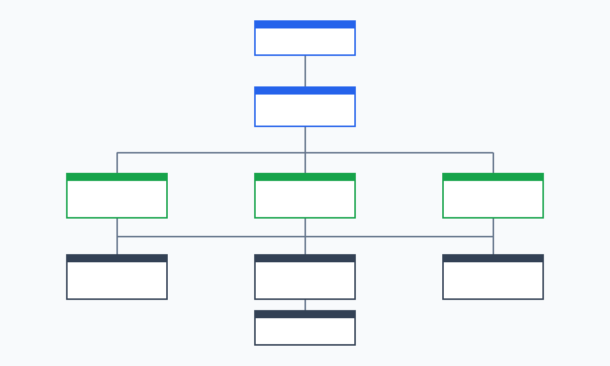

# StrongBox

StrongBox is a three-node distributed secrets manager built for the HNG DevOps
Track Stage 8 assignment. It boots sealed, requires K-of-N unseal shares, stores
versioned encrypted secrets, enforces token policies, issues leases, supports
dynamic PostgreSQL credentials, elects a leader, and keeps a tamper-evident audit
log.

## Public Cluster

- Public URL: `https://157.180.45.114`
- Repository: TODO: add GitHub repository URL before submission.
- Deadline: 2 June 2026, 5PM WAT.

## Quick Start

```bash
docker compose up -d --build
curl -k https://localhost/v1/sys/health
```

For a fresh VPS:

```bash
sudo apt-get update
sudo apt-get install -y docker.io docker-compose-plugin git
git clone <repo-url> strongbox
cd strongbox
docker compose up -d --build
```

## Architecture



Nginx terminates TLS and load-balances requests across three StrongBox nodes.
StrongBox nodes communicate over internal HTTP for consensus heartbeats, vote
requests, and write replication. PostgreSQL is used by the dynamic credentials
engine. Each node keeps its own local data directory for secrets, consensus
state, and audit logs.

## Audit Log

Each audit entry is a JSON line with:

```json
{
  "ts": "2026-06-01T00:00:00Z",
  "token_id": "token-id",
  "op": "read",
  "path": "secret/app/config",
  "version": "1",
  "lease_id": "lease-id",
  "node_id": "node1",
  "prev_hash": "previous-entry-hash",
  "entry_hash": "sha256-canonical-entry",
  "hmac": "hmac-sha256-entry-hash"
}
```

The audit HMAC key is provided through `AUDIT_HMAC_KEY_HEX` and must remain in
process memory only. It is not written to disk by `lib/audit.sh` or
`bin/strongbox-verify`.

Verify a clean log:

```bash
AUDIT_HMAC_KEY_HEX=<hex-key> bin/strongbox-verify /data/audit/audit.log
```

Expected clean output:

```text
OK: entries=<count> final_hash=<hash>
```

Expected tamper output:

```text
TAMPERED: entry index <N> — <entry summary>
```

## Grading Scenarios

Set the URL once:

```bash
export STRONGBOX_URL=https://157.180.45.114
```

Scenario 1: cluster boots sealed.

```bash
curl -k "$STRONGBOX_URL/v1/sys/health"
```

Scenario 2: initialize and unseal with K-of-N shares.

```bash
curl -k -X POST "$STRONGBOX_URL/v1/sys/init" \
  -H 'Content-Type: application/json' \
  -d '{"shares":5,"threshold":3}'

curl -k -X POST "$STRONGBOX_URL/v1/sys/unseal" \
  -H 'Content-Type: application/json' \
  -d '{"share":"<share-1>"}'
```

Scenario 3: write a secret twice and read both versions.

```bash
curl -k -X PUT "$STRONGBOX_URL/v1/secrets/app/config" \
  -H "Authorization: Bearer <token>" \
  -H 'Content-Type: application/json' \
  -d '{"value":"first"}'

curl -k -X PUT "$STRONGBOX_URL/v1/secrets/app/config" \
  -H "Authorization: Bearer <token>" \
  -H 'Content-Type: application/json' \
  -d '{"value":"second"}'

curl -k "$STRONGBOX_URL/v1/secrets/app/config?version=1" \
  -H "Authorization: Bearer <token>"
```

Scenario 4: scoped token allows read and blocks write/out-of-scope paths.

```bash
curl -k "$STRONGBOX_URL/v1/secrets/app/config" \
  -H "Authorization: Bearer <scoped-token>"

curl -k -X PUT "$STRONGBOX_URL/v1/secrets/app/config" \
  -H "Authorization: Bearer <scoped-token>" \
  -H 'Content-Type: application/json' \
  -d '{"value":"blocked"}'
```

Scenario 5: revoked token returns 401 immediately.

```bash
curl -k -X POST "$STRONGBOX_URL/v1/auth/revoke" \
  -H "Authorization: Bearer <root-token>" \
  -H 'Content-Type: application/json' \
  -d '{"token":"<token-to-revoke>"}'

curl -k "$STRONGBOX_URL/v1/auth/self" \
  -H "Authorization: Bearer <token-to-revoke>"
```

Scenario 6: dynamic PostgreSQL credential exists and works.

```bash
curl -k "$STRONGBOX_URL/v1/dynamic-postgres/readonly" \
  -H "Authorization: Bearer <token>"
```

Scenario 7: PostgreSQL outage lease cleanup retries until recovery.

```bash
docker compose stop postgres
sleep <ttl-plus-reaper-interval>
docker compose start postgres
docker compose exec postgres psql -U strongbox -d strongbox -c "select rolname from pg_roles where rolname like 'strongbox_%';"
```

Scenario 8: killing the leader mid-write never double-acks.

```bash
docker compose stop strongbox-1
curl -k -X PUT "$STRONGBOX_URL/v1/secrets/app/failover" \
  -H "Authorization: Bearer <token>" \
  -H 'Content-Type: application/json' \
  -d '{"value":"during-failover"}'
```

Scenario 9: a 2-1 partition lets the majority write and makes the minority
refuse writes.

```bash
docker network disconnect strongbox_strongbox strongbox-3
curl -k -X PUT "$STRONGBOX_URL/v1/secrets/app/partition" \
  -H "Authorization: Bearer <token>" \
  -H 'Content-Type: application/json' \
  -d '{"value":"majority"}'
```

Scenario 10: audit tampering is detected.

```bash
AUDIT_HMAC_KEY_HEX=<hex-key> bin/strongbox-verify /data/audit/audit.log
cp /data/audit/audit.log /tmp/audit-tampered.log
python3 - <<'PY'
from pathlib import Path
p = Path("/tmp/audit-tampered.log")
s = p.read_text()
p.write_text(s.replace("read", "reed", 1))
PY
AUDIT_HMAC_KEY_HEX=<hex-key> bin/strongbox-verify /tmp/audit-tampered.log
```

## Seal And Unseal Hygiene

StrongBox starts sealed. While sealed, only `/v1/sys/health`,
`/v1/sys/init`, and `/v1/sys/unseal` are available. The reconstructed master key
and unseal share buffers must be zeroed after unseal. `POST /v1/sys/seal`
purges the in-memory KEK and returns the node to sealed state.

Required evidence: `screenshots/memory-clean.png`.

## Dynamic Revocation During DB Outage

Dynamic PostgreSQL leases move to `revocation_pending` when PostgreSQL is
unreachable. The lease reaper retries revocation with exponential backoff and
drops the role automatically after the database returns.

## Election Protocol

TODO: paste Bimbo's 200-400 word election protocol section here before final
submission. It must cover terms, vote rules, heartbeat cadence, partition
behavior, and minority detection.

## Screenshots

Required screenshots are tracked in [screenshots/README.md](screenshots/README.md).

## Integration Harness

```bash
test/integration/run.sh
```

The harness fully verifies Scenario 10 and reports honest `SKIP` lines for
teammate-owned scenarios until their modules are present.
